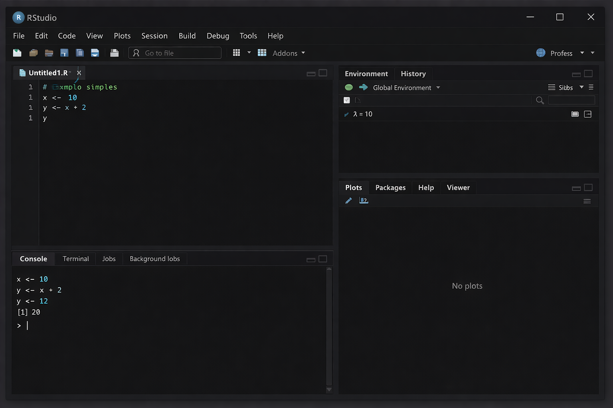

---
# Só mude aqui!!!!
author: "Wadmilson Costa da Fonseca e CRuz"
title: "A beleza da linguangem R"
bibliography: referencias.bib
output: html_document
# A partir daqui nao faca alteracoes!!!!!
link-citations: true
csl: associacao-brasileira-de-normas-tecnicas-ipea.csl
subtitle: "<a href='https://bendeivide.github.io/courses/epaec/' target='_blank'>Estatística e Probabilidade</a> </br> <a href='https://bendeivide.github.io' target='_blank'>Prof. Ben Dêivide (DEFIM/CAP/UFSJ)</a>"
include-before-body: header.html
date: now
date-format: "DD/MM/YYYY, HH:mm"
lang: pt-BR
format:
  html:
    toc: true
    number-sections: true
    theme: bootstrap
    #css: styles.css
    code-fold: true
    code-tools: true
execute:
  echo: true
  warning: false
  message: false
---


## 📌 Introdução

A linguagem R é uma ferramenta poderosa e gratuita utilizada mundialmente para estatística, análise de dados e ciência de dados. Ela foi criada por Robert Gentleman e Ross Ihaka na Universidade de Auckland, Nova Zelândia, e hoje é mantida pela R Foundation for Statistical Computing.
 
O grande diferencial do R é que ele não é apenas um software, mas sim uma linguagem de programação completa, o que significa que você pode escrever comandos para que o computador execute tarefas exatamente como você deseja. Mesmo parecendo complicado no início, com um pouco de prática e seguindo este guia, qualquer pessoa consegue aprender e dominar suas funções básicas.
 

### Objetivo geral

Este material tem como objetivo apresentar os conceitos fundamentais da linguagem R de forma simples e objetiva. Nosso foco é guiar o iniciante desde o processo de instalação até a compreensão de como o R organiza e trabalha com as informações, fornecendo exemplos práticos para facilitar o aprendizado.

 
## 📚  Fundamentação Teórica

### Como baixar e intalar o R 

Para começar a usar, primeiro precisamos instalar dois programas:
 
1. O R Base: É o "motor" da linguagem.- Acesse: https://cran.r-project.org/
- Escolha seu sistema operacional (Windows, Mac ou Linux) e clique em Download.
2. O RStudio: É a "casa" onde vamos escrever os códigos. Ele deixa o programa mais bonito e fácil de usar.- Acesse: https://www.rstudio.com/products/rstudio/download/
Baixe a versão Desktop Free.
 
OBS: Após instalar, ao abrir o RStudio, você verá que ele já conecta automaticamente com o R que você instalou primeiro


Mais detalhes sobre as instalações do R e Rstudio podem ser vistas nas videos aulas e nos livros disponivel em https://bendeivide.github.io/. 


### Como o R trabalha e os quadrantes da tela
 
O R tem três princípios (CHAMBERS, 2016) fundamentais que é necessario conhecer: o princípio do objeto (tudo que existe em R é um objeto), o princípio da função (tudo que acontece no R é uma chamada de função), e o princípio da interface (interfaces para outros programas são parte do R).
Quando você abre o RStudio, a tela é dividida em 4 partes principais, que chamamos de quadrantes:
 
1. Editor de Código ( superior esquerdo): É onde você escreve seus comandos. É como se fosse um bloco de notas.
2. Console (inferior esquerdo): É onde o R executa o que você escreveu. É aqui que os resultados aparecem.
3. Ambiente/Histórico (superior direito): Mostra quais dados e objetos você criou e guardou na memória.
4. Arquivos/Gráficos/Ajuda (inferior direito): Aqui você vê seus arquivos, os gráficos que criar e pode pesquisar dúvidas.
 
Como funciona: Você escreve o comando no Editor, aperta (Ctrl + Enter) e o resultado aparece no Console. Assim como esta na imagem a seguir.

{width=80%}

Para conseguirmos escrever o nosso relatorio ou texto, precisamos de usar pacotes que armazenaram as nossas informações.

### Oque são pacotes do R

O R já vem com várias funções prontas, mas a comunidade cria ferramentas novas o tempo todo. Essas ferramentas extras são os Pacotes.
 
Para instalar: Usamos "install.packages("nome_do_pacote")".
Para usar: Usamos "library(nome_do_pacote)".

Dica: Você instala apenas uma vez, mas precisa carregar ("library") sempre que abrir o programa.

Temos pacotes como:

1- O ggplot2, é usado para gráficos.
Exemplo:

```{r}
library(ggplot2)

dados <- data.frame(
  x = c(1,2,3,4),
  y = c(10,20,15,25))
ggplot(dados, aes(x, y)) + geom_line()
```

Gera um gráfico de linha.

2- O dplyr, usado para organizar e filtrar dados.
Exemplo:

```{r}
library(dplyr)

dados <- data.frame(nome = c("Ana", "João", "Carlos"),
  idade = c(20, 25, 30))
dados %>%
  filter(idade > 20)
```

Filtra pessoas com idade maior que 20.

3- O tidyr, arruma dados “bagunçados”.
Exemplo:

```{r}
library(tidyr)

dados <- data.frame(
  nome = c("A", "B"),
  nota1 = c(7,8),
  nota2 = c(9,10))
pivot_longer(dados, cols = nota1:nota2)
```

Transforma dados de formato largo → longo.

4- O readr, para importar arquivos.
Exemplo:

```{r}
library(readr)
#dados <- read_csv("dados.csv")
```

Lê arquivos CSV.

5- O shiny, criar aplicativos interativos.
Exemplo simples:

```{r}
library(shiny)

ui <- fluidPage("Olá, mundo!")
server <- function(input, output) {}
shinyApp(ui, server)
```

Cria um app básico.

6- O knitr, usado em R Markdown.
Exemplo:

```{r}
knitr::kable(head(mtcars))
```

Cria tabela formatada no relatório.

7- O lubridate, facilita trabalhar com datas.
Exemplo:

```{r}
library(lubridate)
data <- ymd("2026-04-11")
year(data)
```

Extrai o ano. E entere outros pacotes. 

Como em outras linguagens, no R tanbém possue diversas funções.

### As funções do R

Funções são "receitas de bolo" prontas. Elas pegam informações, processam e devolvem um resultado. Tudo no R é função! Elas sempre têm parênteses (). As funções básicas como sum(): soma os valores, mean(): calcula a media, e o sqrt() : calcula a raiz quagrada, achar o minimo, são amplamente utilizadas para operações matemáticas, enquanto funções como data.frame() : criar tabelas, e subset() : filtrar dados são empregadas na manipulação e organização de dados. Temos outros como o max() : achar o maximo, o min() :  o c() : conbinar valores, o <- (atribuição), o plot() : graficos basicos, o summary() : resumo estatístico, e muitos outros. 
 
Exemplo:

```{r}

# Criando um vetor de notas
notas <- c(7, 8, 5, 9, 6)
# Soma das notas
soma <- sum(notas)
# Média
media <- mean(notas)
# Maior nota
maior <- max(notas)
# Menor nota
menor <- min(notas)
# Quantidade de alunos
quantidade <- length(notas)
# Mostrando resultados
soma
media
maior
menor
quantidade
```
 Já que até aqui, vimos como intalar o R e o Rstodio, vimos como R trabalha e os seus quadrantes, ouseja, a interface do Rstudio, sabemos oque são pacotes e conhecemos alguns deles, sabemos oque é uma função e conhecemos algumas funções.

Agora daremos um passo a mais, saberomos como se cria um projeto no R.

### Criando projetos 

Para manter seu trabalho organizado, é ideal criar um Projeto no RStudio. Cria-se uma pasta específica onde tudo (códigos, dados, resultados) fica salvo junto.
 
Para criar um projeto primeiramente vamos clicar em "File" -> "New Project", depois escolhemos "New Directory" -> "New Project", em seguida damos um nome ao projeto, ex: "MeuPrimeiroProjeto", e clicamos em "Create Project"".

Ao seguir esse passos o seu projeto estara pronto para ser elaborado.

Agora, aprenderemos sobre a estrutura dos dados  e como se faz a importação e exportação dos dados no R.
 
### Estrutura de dados e importação e exportação de dados 
No R, as informações são organizada e armazenada em formatos diferente.
Alguns desses formatos, mais usados são:

1- O vetor (Vector), sendo a estrutura mais básica que guarda valores do mesmo tipo.

Exemplo:

```{r}
x <- c(1, 2, 3, 4)
```

Podem ser números, como tambem texto.

```{r}
nomes <- c("Ana", "João", "Carlos")
```

2- A matriz (Matrix), são dados em formato de tabela (linhas e colunas), onde todos os elementos são do mesmo tipo.

Exemplo:

```{r}
matriz <- matrix(c(1,2,3,4), nrow = 2, ncol = 2)
```

3- O Data Frame, sendo mais usada no dia a dia como a realização de uma tabela do Excel, e pode ter tipos diferentes em cada coluna.

Exemplo:

```{r}
dados <- data.frame(
  nome = c("Ana", "João"),
  idade = c(20, 25),
  aprovado = c(TRUE, TRUE))
```

Ele acaba misturando texto, número e lógico.

4- A lista (List), que pode guardar qualquer coisa dentro, e possui uma estrutura mais flexível.

Exemplo:

```{r}
lista <- list(
  nome = "Ana",
  idade = 20,
  notas = c(7, 8, 9))
```

Ela pode ter vetor, número, texto tudo junto.

5- O fator (Factor), sendo usado para categorias.

Exemplo:

```{r}
sexo <- factor(c("Masculino", "Feminino", "Feminino"))
```

Ele é muito usado em estatística.

Um exemplo usando todos juntos:

```{r}
# Vetor
notas <- c(7, 8, 9)
# Matriz
mat <- matrix(notas, nrow = 3)
# Data frame
df <- data.frame(nome = c("Ana", "João"), nota = c(7, 8))
# Lista
lista <- list(df, notas)
```

È claro que os formatos não são só esses, existe varios, esses são os basicos para termos a minima ideia de como  funcionam.

Em relação a importação e exportação de dados, vejamos que mutas das vezes temos dados em arquivos Excel ou CSV e queremos trazer para o R.

Para importar esses dados, ou melhor, para trazer esses dados para dentro, usaremos uma linha de codigo para cada caso.

Para arquivos CSV, escrevemos o seguinte:

```{r}
#meus_dados <- read.csv("dados.csv", header = TRUE)
```

Agora para arquivos Excel precisaremos liberar o pacote 'readxl', por isso escrevemos o seguinte:

```{r}
library(readxl)
#meus_dados <- read_excel("dados.xlsx")
```

Depois de fazer tudo isso o R precura o nosso arquivo, e encontrando ele da uma observasação, entende, transforma em Data Frame (em formato de tabela),e guarda dentro da caixinha que nomeamos de "meus_dados". 

Se depois do R fazer isso e não enviar nenhuma mensagem é porque deu certo, pois o silencio é a resposta preferida do computador, porem se aparecer vermelho é porque deu alguma coisa errada então precisamos ver oque colocamos errado.

Para fazer a exportação salvando um data frame como CSV, escrevemos o seguinte:

```{r}
#write.csv(minha_tabela, file = "minha_tabela_pronta.csv")
```

Após isso, o R pega na tabela que foi criado quando fizemos a importação, e  faz um arquivo de verdade na pasta.

Agora, falaremos de uma das coisas mais lindas realizada pelo R, que é a sua interação com outras linguagens.


### A interface do R com outras Linguagens

Uma das grandes vantagens do R é a sua flexibilidade e capacidade de se conectar com outras ferramentas. Ele não funciona sozinho; ele "conversa" com outras linguagens de programação, bancos de dados e sistemas, permitindo que você use o melhor de cada mundo em um mesmo projeto.

Isso é muito importante porque cada uma das linguagem tem o seu ponto forte. O R é melhor para estatística e gráficos, o Python é ótimo para machine learning e automação, o SQL é essencial para bancos de dados grandes, e o C/C++ serve para deixar cálculos muito mais rápidos.

Principais Integrações
 
1- A integração com Python: é a parceria mais famosa! Com o pacote "reticulate", você pode rodar código Python diretamente dentro do seu script R, usar bibliotecas Python (como Pandas ou Scikit-learn) e trocar dados entre as duas linguagens facilmente.
 
Exemplo Prático:
 
```{r}

# Carregar o pacote
library(reticulate)
# Agora você pode escrever código Python usando py_run_string()
py_run_string("
import numpy as np
numeros = np.array([1, 2, 3, 4, 5])
print(numeros.mean())
")
```

 2- A integração com C e C++: quando você precisa fazer cálculos muito pesados ou rápidos, o R pode chamar funções escritas em C ou C++. Isso é muito usado por desenvolvedores de pacotes para deixar o software mais eficiente.
Usando as funções como o "C()"  ou "Call()" conectamos com os códigos compilados.
 
 3- A integração com Bancos de Dados (SQL): não precisamos importar todos os dados para o R. Pode se conectar diretamente em servidores como MySQL, PostgreSQL, SQL Server e fazer consultas usando a linguagem SQL sem sair do RStudio.
 
Exemplo com SQLite:
 
```{r}

# Pacote para conexão
library(RSQLite)
# Conectando ao banco
con <- dbConnect(SQLite(), dbname = "meu_banco.db")
# Escrevendo uma consulta SQL dentro do R
#dados <- dbGetQuery(con, "SELECT * FROM tabela_clientes WHERE idade > 18")
# Ver o resultado
#head(dados)
```

 
4- A integração com LaTeX e Markdown: o R trabalha muito bem com ferramentas de escrita de documentos. Com o pacote "rmarkdown", você cria relatórios, PDFs, apresentações e sites que misturam texto, código R e os resultados automaticamente. É a base do que chamamos de Ciência Reprodutível.
 
 Tambem temos outras linguagens que o R tem interfaces, como o Java (pacote "rJava"), a Julia (para computação de alto desempenho), e o Fortran (muito usado em cálculos matemáticos antigos e robustos).

Portanto, esses foram as  principais estruturas do corpo da linguagem R.
 

### Considerações Finais

Apresentamos os principais fundamentos da linguagem R, desde a instalação, organização da interface, uso de funções, pacotes e manipulação de dados. Vimos que, apesar de exigir prática inicial, o R é uma ferramenta poderosa, gratuita e versátil, capaz de se integrar com outras linguagens.
 
Aprender R exige dedicação, mas os benefícios são enormes. Com os conceitos aqui apresentados, você já possui a base necessária para desenvolver projetos, analisar informações e evoluir nos estudos de estatística e ciência de dados.

## 📖 Referências

BRITO, Ben Dêivide. leem: Learning from Elementary Statistics Methodology. Disponível em: https://bendeivide.github.io/leem/. Acesso em: 12 de abr. de 2026.

CHAMBERS, John M. Extending R. Boca Raton: CRC Press, 2016.. 

DALGAARD, Peter. Estatística Básica com R. Rio de Janeiro: Elsevier, 2008.

IHAKA, Ross; GENTLEMA

KABAKOFF, Robert. R in Action: Data Analysis and Graphics with R. 2. ed. Manning Publications, 2015.

POSIT. RStudio Documentation. Disponível em: https://posit.co/resources/. Acesso em: 12 de abr. de 2026.

R CORE TEAM.R: A Language and Environment for Statistical Computing. Vienna: R Foundation for Statistical Computing, 2025. Disponível em: https://www.R-project.org/. Acesso em: 12 de abr. de 2026.

WICKHAM, Hadley; GROLEMUND, Garrett. R para Ciência de Dados. 1. ed. Disponível em: https://livro.curso-r.com/. Acesso em: 12 de abr. de 2026.

WICKHAM, Hadley. Advanced R. 2. ed. Boca Raton: CRC Press, 2019. Disponível em: https://adv-r.hadley.nz/. Acesso em: 12 de abr. de 2026.


