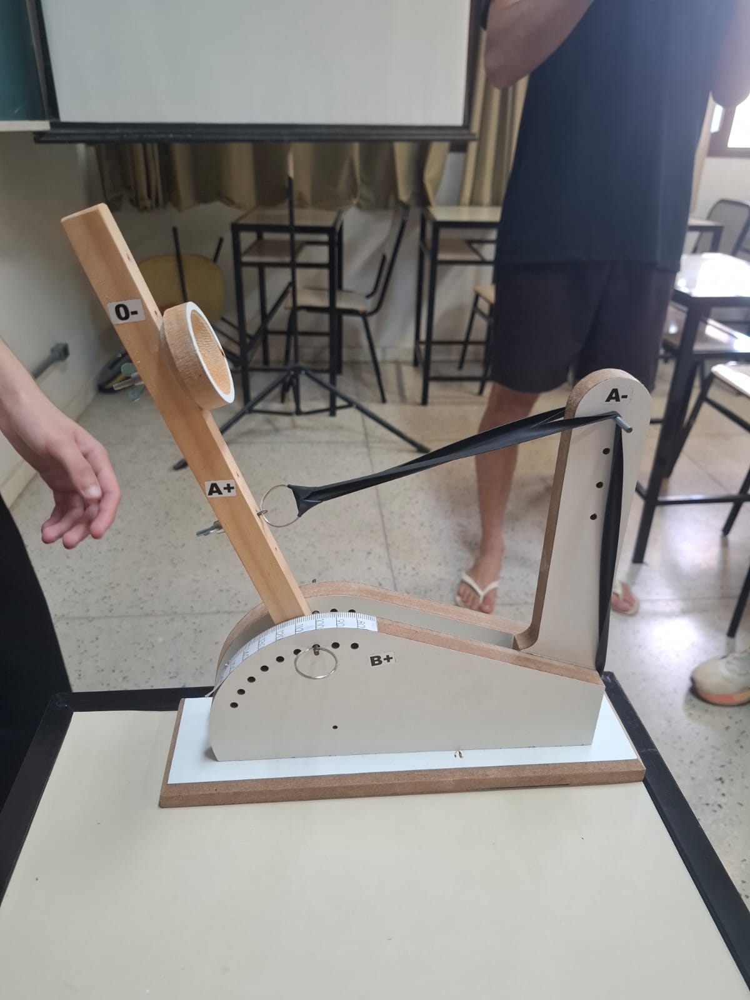
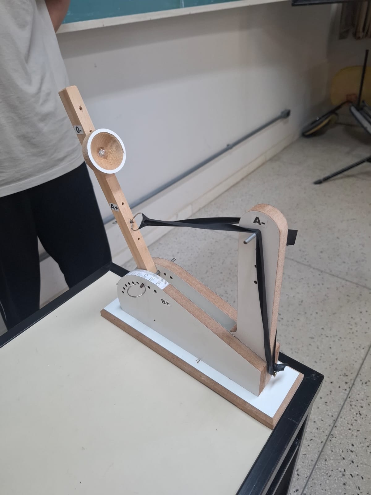
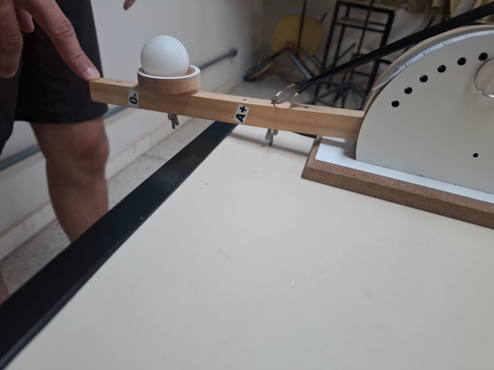

---
# Só mude aqui!!!!
author: "Wadmilson Costa da Fonseca e Cruz"
title: "Relatorio do experimento da cataputa"
bibliography: referencias.bib
# A partir daqui nao faca alteracoes!!!!!
link-citations: true
csl: associacao-brasileira-de-normas-tecnicas-ipea.csl
subtitle: "<a href='https://bendeivide.github.io/courses/epaec/' target='_blank'>Estatística e Probabilidade</a> </br> <a href='https://bendeivide.github.io' target='_blank'>Prof. Ben Dêivide (DEFIM/CAP/UFSJ)</a>"
include-before-body: header.html
date: now
date-format: "DD/MM/YYYY, HH:mm"
lang: pt-BR
format:
  html:
    toc: true
    number-sections: true
    theme: bootstrap
    #css: styles.css
    code-fold: true
    code-tools: true
execute:
  echo: true
  warning: false
  message: false
---


## 📌 Introdução
Como forma de aplicar os conceitos que estudamos na aula de estatistica de um jeito mais pratico, usando a catapulta, realizamos 40 lançamentos seguidos, midimos e anotamos as distancias alcançadas em cada lançamento.
A partir desses valores anotados, vamos trabalhar os dados aplicando os conceitos estudados. 


## 🎯 Objetivo
### Objetivos especificos

Realizar a descrição dos dados coletados por meio de tabulação e apresentação gráfica, calcular medidas de posição e de dispersão, tanto com ou sem agrupamento de dados, e discutir as diferença observadas entre os resultados. 
Além disso, analisar a assimetria e a curtose do conjunto dos dados, apresentando justificativas sobre a importância dessas medidas para a descrição estatística, bem como indicar possíveis falhas ocorridas durante a execução do experimento.  

## ⚙️ Metodologia

O experimento foi realizado em sala de aula. A catapulta foi posicionada sobre uma mesa com altura de 78 cm, e utilizamos uma trena para medir a distancia alcançada em cada lançamento. 
Na catapulta, utilizamos diferentes combinações variações: A+ (segundo pino,de cima para baixo ), A-(primeiro pino, de cima para baixo), O- (terceiro pino, de cima para baixo), e B+ (angulo de 45 graus).

{width=50%}{width=50%}{width=50%}

Formamos dois grupos, onde um realizou os lançamentos primeiro e depois o outro. No primeiro grupo, as funções foram divididas da seguinte forma: Maria Eduarda e Marcos ficaram responsáveis pela execução dos lançamentos, Igor e o Lucas pela medição das distancias, João Pedro pela captura das fotos, e Wadmilson pela coleta e anotação dos dados. 
Ao final, Marcos organizou todas as medidas coletadas e eviou-as como dados amostrais para o professor, e para os demais integrantes do grupo.

A catapulta foi posicionada a uma distancia inicial de 250 cm (2,5 metros) do ponto de referencia.

Para obter a distancia total de cada lançamento, somamos esse valor fixo com a medida adicional registrada em cada lançamento, e os dados recolhidos foram: 346, 339, 339, 332, 293, 368, 365, 341, 329, 339, 323, 335, 369, 347, 352, 340, 338, 350, 341, 336, 320, 341, 330,328, 336, 318, 275, 329, 357, 317, 302, 331, 359, 333, 324, 334, 339, 332, 331, 320.

{width=40%}


## Descrição dos dados por meio de tabulação e apresentação gráfica

### Dados sem agrupamento (Dados brutos) e análise sem intervalos de classe
```{r}

#|code-fold: True
#|warning: False
library(leem)
dados <- c(346, 339, 339, 332, 293, 368, 365, 341, 329, 339, 323, 335, 369, 347, 352, 340, 338, 350, 341, 336, 320, 341, 330,328, 336, 318, 275, 329, 357, 317, 302, 331, 359, 333, 324, 334, 339, 332, 331, 320)
# Transformar para dados discretos/sem agrupamento
dados_sem_agrupo <- new_leem(dados, variable = 'discrete')
# Tabela de frequencia
tabela_sem<- tabfreq(dados_sem_agrupo)
tabela_sem
# Criando o graficorafico
Grafico <- barplot(table(dados), main = 'Meu Grafico', xlab = 'valores', ylab = 'frequencia')
# MEDIDAS DE POSIÇÃO
#| code-fold: True
media <- mean(dados)
mediana <- median(dados)
# Calcula a moda
tabela <- table(dados)
moda <- as.numeric(names(tabela[tabela == max(tabela)]))
cat("--- MEDIDAS DE POSIÇÃO ---\n")
cat("Média Aritmética:", media, "\n")
cat("Mediana:", mediana, "\n")
cat("Moda:", moda, "\n\n")
# MEDIDAS DE DISPERSÃO
#| code-fold: True
amplitude_total <- max(dados) - min(dados)
variancia <- var(dados)
desvio_padrao <- sd(dados)
coeficiente_variacao <- (desvio_padrao / media) * 100
erro_padrao_media <- desvio_padrao / sqrt(length(dados))
cat("--- MEDIDAS DE DISPERSÃO ---\n")
cat("Amplitude Total:", amplitude_total, "\n")
cat("Variância:", variancia, "\n")
cat("Desvio Padrão:", desvio_padrao, "\n")
cat("Coeficiente de Variação (%):", coeficiente_variacao, "\n")
cat("Erro Padrão da Média:", erro_padrao_media, "\n")
```
## Dados agrupados e analise com intervalos de classes 

```{r}

#| code-fold: true
#| warning: false
library(leem)

dados <- c(346, 339, 339, 332, 293, 368, 365, 341, 329, 339, 323,
           335, 369, 347, 352, 340, 338, 350, 341, 336, 320, 341,
           330, 328, 336, 318, 275, 329, 357, 317, 302, 331, 359,
           333, 324, 334, 339, 332, 331, 320)

# Transformar para dados contínuos/com agrupamento
dados_com_agrupo <- new_leem(dados, variable = "continuous")

# Tabela de frequência
tabela_com <- tabfreq(dados_com_agrupo)
tabela_com


### Gráfico (Histograma)
#| code-fold: true
barplot(tabela_com, main = "Histograma com Intervalos", 
        xlab = "Distância (cm)", ylab = "Frequência", col = "lightblue")


### Medidas de Posição 
#| code-fold: true
media <- mean(dados)
mediana <- median(dados)
moda <- as.numeric(names(which.max(table(dados))))

# --- MEDIDAS DE DISPERSÃO ---
amplitude <- max(dados) - min(dados)
variancia <- var(dados)
desvio_padrao <- sd(dados)
coeficiente_variacao <- (desvio_padrao / media) * 100
erro_padrao_media <- desvio_padrao / sqrt(length(dados))

# --- EXIBIR TUDO ---
cat("\n\n")
cat("MEDIDAS DE POSIÇÃO\n")
cat("Média:", round(media, 2), "\n")
cat("Mediana:", mediana, "\n")
cat("Moda:", moda, "\n")
cat("MEDIDAS DE DISPERSÃO\n")
cat("Amplitude Total:", amplitude, "\n")
cat("Variância:", round(variancia, 2), "\n")
cat("Desvio Padrão:", round(desvio_padrao, 2), "\n")
cat("Coef. Variação:", round(coeficiente_variacao, 2), "%\n")
cat("Erro Padrão Média:", round(erro_padrao_media, 2), "\n")
cat("\n")
```

### Análise e discussão dos resultados
 Ao analisar os resultados obtidos, observa-se que os valores calculados foram extremamente próximos. pois os dados se distribuíram de forma bastante uniforme dentro das classes e porque utilizamos os pontos médios para o cálculo. 

O  agrupamento dos dados facilita a visualização gráfica e a leitura da tabela, sem perder a precisão das informações principais. Porém, trata-se sempre de uma estimativa: perdemos um pouco da identidade individual de cada valor em troca de uma visão geral. Já os dados brutos oferecem exatidão total.

## Medidas de forma: Assimetria e Curtose 
 
### Coeficiente de Assimetria (Pearson)
 
A assimetria mede se os dados estão concentrados à esquerda, à direita ou se distribuem de forma simétrica em relação à média.
Cálculo:

Sk = 3(Média - Mediana)/Desvio Padrão
Sk = 3(334,45 - 335,5)/ 18,37
Sk = 3(-1,05)/ 18,37
Sk = -3,15/ 18,37
Sk ≈ -0,17

Sk = 0: distribuição simétrica 
Sk > 0: assimetria positiva (calda para direita)
Sk < 0: assimetria negativa (calda para esquerda)

Como o valor calculado é -0,17, muito próximo de zero, a distribuição apresenta assimetria praticamente Nula / levemente negativa.
O histograma tem formato muito próximo a uma "curva de sino" perfeita.

###  Coeficiente de Curtose

A curtose mede o "grau de achatamento" ou "pontuação" da curva de frequência, comparando-a com a Curva Normal.

Ela é classificada em: 

mesocúrtica: curva normal (padrão); 
leptocúrtica: curva mais "alta e pontuda" (dados muito concentrados);
platicúrtica: curva mais "baixa e achatada" (dados muito espalhados);

Com base na dispersão e quartis, observa-se que os dados estão bem concentrados em torno da média, com caudas adequadas, logo, a distribuição é mesocúrtica, pois seu formato é muito semelhante ao da distribuição normal padrão.

Essas medidas são importantes porque a média e o desvio padrão sozinhos não revelam toda a informação. Saber que a distribuição é simétrica confirma que a média é uma boa medida representativa dos dados, caso fosse muito assimétrica, a mediana seria a melhor opção. 

Muitos modelos e testes estatistico, como o Teste T ou Análise de Regressão, exigem que os dados tenham distribuição próxima da normal, e o valor -0,17 obtido valida o uso dessas ferramentas.

Conhecer a forma da curva ajuda a compreender o comportamento do fenômeno estudado, neste caso, os valores são consistentes e bem distribuídos em torno do centro.

### Possíveis falhas de execução do experimento

Durante a coleta dos dados, observou-se que os resultados do lançamento 5, 27 apresentaram valores muito inferiores aos demais, indicabdo provaveis erro na execução.

Embora sejam esperadas pequenas variações entre os lançamentos, a diferença observada foi excessiva. 

Além disso, ocorreram falhas na medição por parte da equipe: nem todas as marcções foram feitas exatamente no ponto de impacto da bolinha. A trena ficou ligeiramente deslocada da referencia e, em alguns casos, oponto registrado não correspondia ao primeiro contacto entre da bolinha com o solo. 


## 📖 Referências